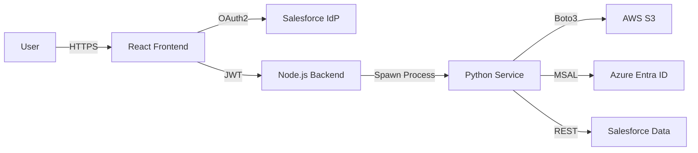

Com certeza. O formato anterior pode ter quebrado porque o Markdown não lida bem com blocos de código dentro de outros blocos de código na visualização do chat.

Aqui está o arquivo `README.md` **inteiro, unificado e formatado corretamente**.

Você deve apagar **tudo** o que está no seu `README.md` atual e colar este conteúdo abaixo. A seção "Getting Started" já está posicionada no lugar certo (logo após a arquitetura, para quem quiser rodar o projeto rapidamente).

### 📄 Copie e cole no `README.md`

```markdown
# ⚡ Triad System Design Lab
**Secure Multi-Cloud Orchestration Platform**

> **Current Status:** Phase 1 Complete (The Connector)

This project demonstrates a robust implementation of the **Triad Architecture**, connecting **AWS (Storage)**, **Azure (Identity)**, and **Salesforce (CRM)** into a unified control plane. It simulates a real-world Enterprise Integration scenario using a Secure Backend-for-Frontend (BFF) pattern.

---

## 🏗️ Architecture Overview

The system allows an Architect (User) to trigger complex cloud automation scripts securely via a web dashboard. It solves the problem of "Who is running this script?" by enforcing strict Identity verification before execution.

### High-Level Design
1.  **Frontend (React + Vite):** A secure dashboard for triggering pipelines.
2.  **Backend (Node.js + Express):** Handles OAuth2 security, JWT issuance, and process orchestration.
3.  **Services (Python):** Independent automation scripts running in isolated virtual environments.
4.  **Infrastructure:** Redis (Session Store) and Docker.



---

## 🚀 Getting Started

Follow these instructions to set up the environment from scratch.

### 1. Prerequisites

Ensure you have the following installed:

* **Node.js** (v18 or higher)
* **Python** (3.10 or higher)
* **Docker** (Required for Redis)

### 2. Security Setup (RSA Keys)

The Backend requires an RSA Key Pair to sign and verify JSON Web Tokens (JWT).
Run this inside the `backend` folder:

```bash
cd backend
openssl genrsa -out private.key 2048
openssl rsa -in private.key -pubout -out public.key
cd ..

```

### 3. Infrastructure (Redis)

We use Redis to manage user sessions and blocklists. Run this via Docker:

```bash
sudo docker run --name triad-redis -p 6379:6379 -d redis

```

### 4. Environment Variables

Create a `.env` file in the **root** directory of the project.
Copy the structure below and fill in your keys:

```ini
# --- SYSTEM ---
PORT=3001

# --- SALESFORCE OAUTH (Node.js) ---
SF_CLIENT_ID=your_salesforce_consumer_key
SF_CLIENT_SECRET=your_salesforce_consumer_secret
SF_CALLBACK_URL=http://localhost:3001/auth/callback
SF_LOGIN_URL=[https://login.salesforce.com](https://login.salesforce.com)

# --- CLOUD AUTOMATION (Python) ---
AWS_ACCESS_KEY_ID=your_aws_key
AWS_SECRET_ACCESS_KEY=your_aws_secret
AWS_REGION=us-east-1
AWS_BUCKET_NAME=your_bucket_name

AZURE_TENANT_ID=your_tenant_id
AZURE_CLIENT_ID=your_client_id
AZURE_CLIENT_SECRET=your_client_secret

SF_USERNAME=service_account_email
SF_PASSWORD=service_account_password
SF_TOKEN=security_token

```

### 5. Installation

**Install Backend Dependencies:**

```bash
cd backend
npm install
cd ..

```

**Install Frontend Dependencies:**

```bash
cd frontend
npm install
cd ..

```

**Setup Python Environment:**

```bash
python3 -m venv venv
source venv/bin/activate
pip install -r services/week-1-the-connector/requirements.txt

```

---

## ⚡ Running the Platform

You need to run the Backend and Frontend in separate terminals.

**Terminal 1: Backend Orchestrator**

```bash
cd backend
node server.js

```

*Expected Output: `🌐 Backend Orchestrator running at http://localhost:3001*`

**Terminal 2: Frontend Dashboard**

```bash
cd frontend
npm run dev

```

*Expected Output: `Local: http://localhost:5173*`

---

## 🛡️ Security Features Implemented

* **OAuth 2.0 (Authorization Code Flow):** No passwords stored in the frontend. Uses Salesforce as the Identity Provider.
* **JWT (RS256):** Tokens are signed with a private key (Backend only) and verified with a public key.
* **Middleware Protection:** API routes (`/run-week1`) are guarded. Requests without a valid Bearer Token are rejected (401 Unauthorized).
* **Secure Child Process:** Python scripts are executed in a controlled environment, preventing command injection.

## 📦 Tech Stack

* **Frontend:** React, Vite, CSS Modules
* **Backend:** Node.js, Express, Redis, IO-Redis, JWT
* **Automation:** Python, Boto3 (AWS), MSAL (Azure), Simple-Salesforce
* **DevOps:** Docker, Git

---

## 🔧 Troubleshooting

**Error: `redirect_uri_mismatch**`

* Ensure your `.env` says `http://localhost:3001/auth/callback`.
* Ensure Salesforce App Manager Callback URL matches exactly.
* Wait 5 minutes after changing settings in Salesforce.

**Error: `invalid_request: missing required code challenge**`

* Go to Salesforce App Manager -> Edit.
* **Uncheck** "Require Proof Key for Code Exchange (PKCE)".
* Save and wait 5 minutes.

```

```
